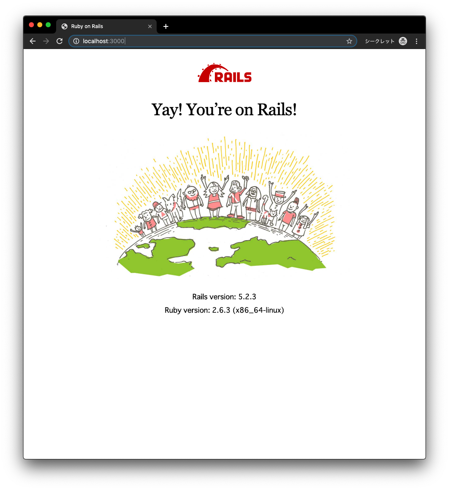

# dockerails

## This is a tool to develop rails app on docker

### If you want to use this...
```bash
$ git clone https://github.com/NasSilverBullet/dockerails.git
$ cd dockerails
```

### If you want to create new app...
```bash
$ make init
$ make credential # credentials:edit
```

### If you want to start the container...
```bash
$ make up # docker-compose up
```
or
```bash
$ make up-d # docker-compose up -d
```
**Access to http://localhost:3000**

**Happy hacking!!**


### If you want to inject new processes with docker exec...
```bash
$ make a='rails generate controller Users new'
```

### If you want to create a new bash session in the container...
```bash
$ make bash
```